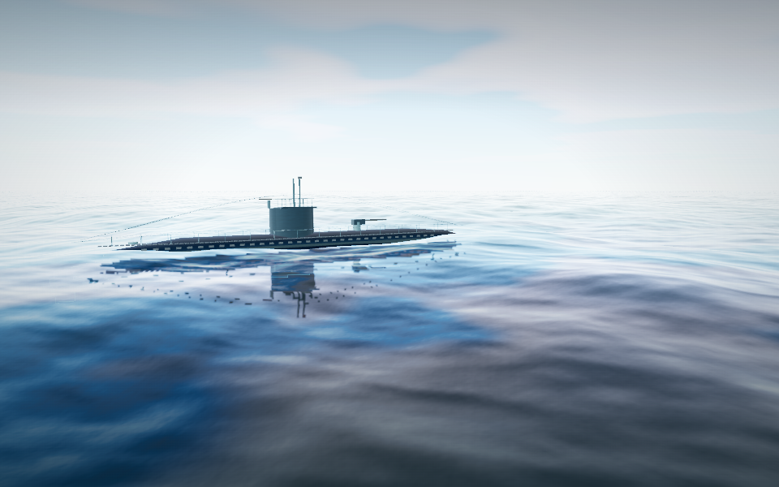

# Roughness-filtered water reflections

Planar boat and sky reflections previously stayed sharp as water roughness increased. That produced jagged reflected silhouettes on otherwise rough wave faces. The reflection target now has mipmaps, and the water shader selects a filtered level from the existing surface roughness and reflection resolution. Calm surfaces retain sharper detail; rougher surfaces soften reflections naturally.

The change uses the existing reflection render and existing roughness controls. Its additional cost is generating and storing the reflection mip chain. It adds no sampler; the WebGL water material still uses 15 fragment samplers with shadows. The immutable reflection UV root and shared reflector/texture remain intact.

## Matched comparison

The stopped-hull fixture below uses identical tuning, seed, time, camera and lighting in both builds. Inspect the reflected hull beneath the vessel: the filtered version removes the broken, sharp-edged mirror pattern.

| Before | After |
| --- | --- |
|  |  |

## Verification

- `npm run check` and `npm run build` pass; standalone build `f9178c2fd87b`.
- `npm run test:water-driver` passes all eight shader-generation cases and four GLES program links.
- `npm run test:water-browser` passes on actual WebGPU and WebGL 2, including scene rendering, repeated quality changes, resource disposal, refraction toggles and water saves. No browser errors were reported.
- Twenty matched stills cover calm noon, low-sun swell, overcast storm, grazing views and a stopped hull on both backends. Two low-sun motion clips were also reviewed. Before/after tuning, camera and duration were checked for equality.

Raw images, clips, settings and build hashes are retained in the local gallery at `artifacts/water-reflection/review/index.html`. To reproduce after preserving a current pre-change build as `artifacts/water-reflection/before.html`:

```sh
WATER_BEFORE=artifacts/water-reflection/before.html \
WATER_REVIEW_FOLDER=artifacts/water-reflection/review \
WATER_REVIEW_MATCH_LOOKS=1 \
WATER_REVIEW_SCENES=calm-noon,low-sun-swell,overcast-storm,grazing-swell,stopped-hull \
xvfb-run -a node scripts/capture-water-review.mjs
```

`WATER_REVIEW_MATCH_LOOKS=1` applies the same art tuning to both builds. Leave it unset when comparing against a historical build that predates those settings. Browser verification uses SwiftShader; this pass does not claim physical-device FPS results.
