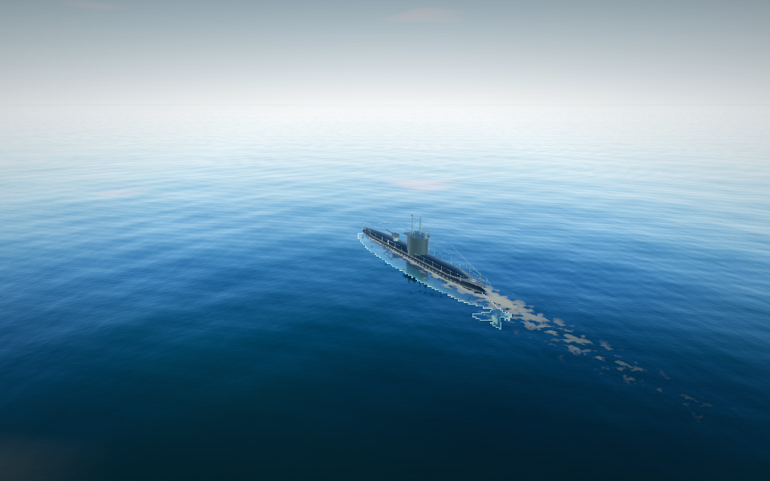
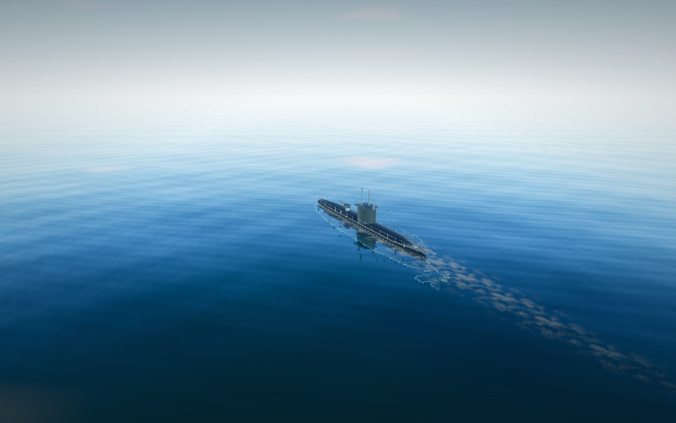
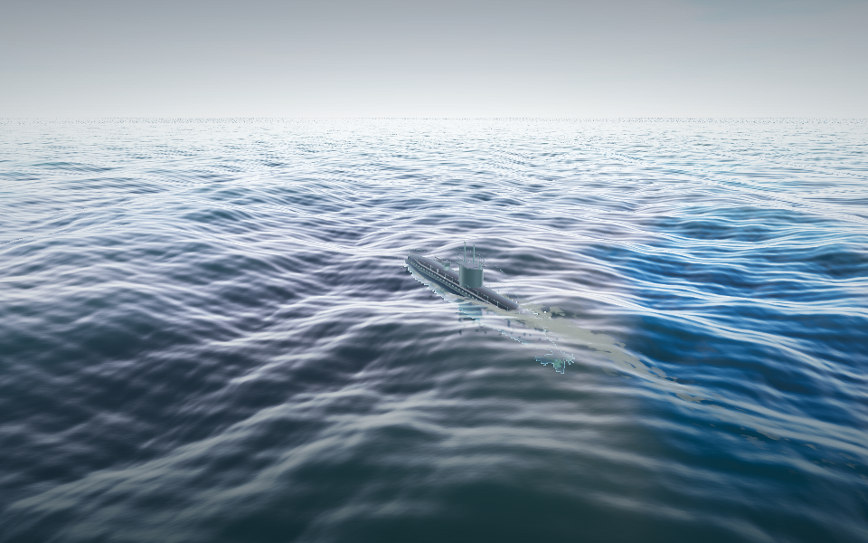
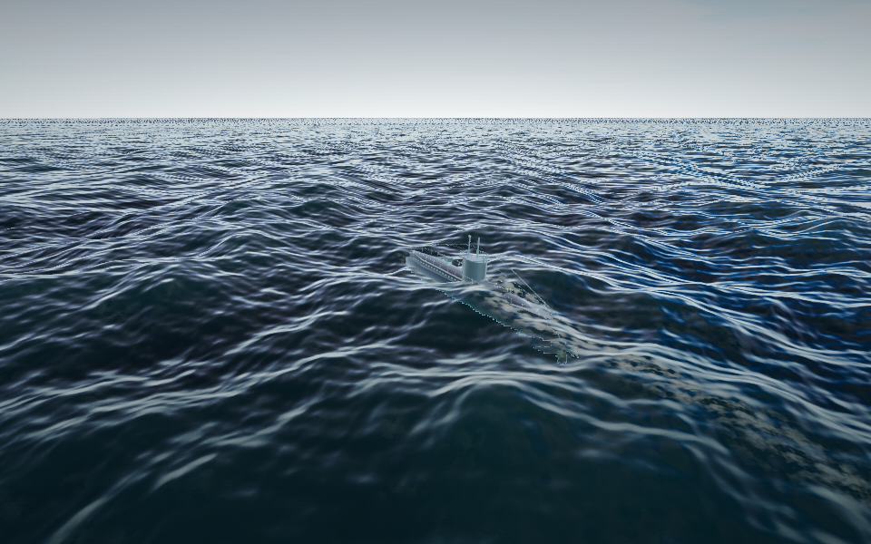
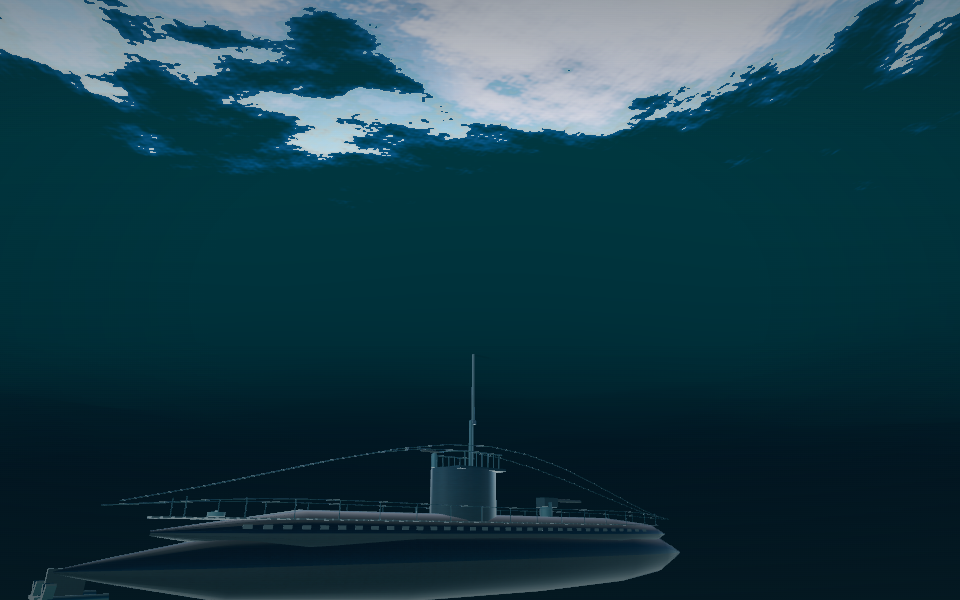
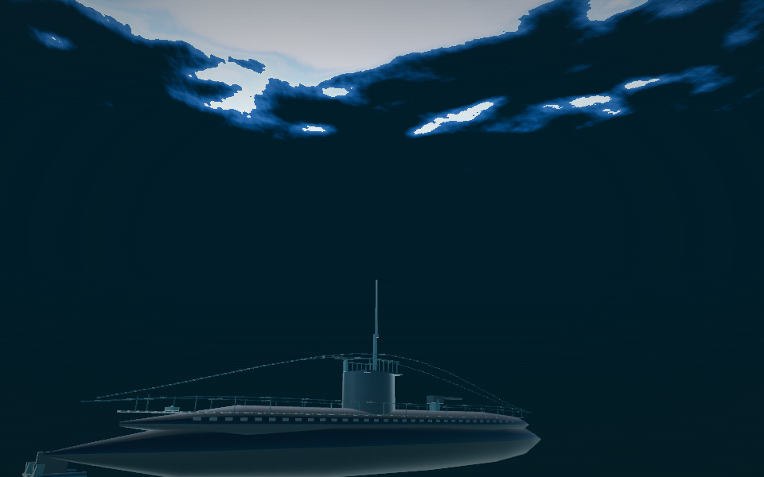
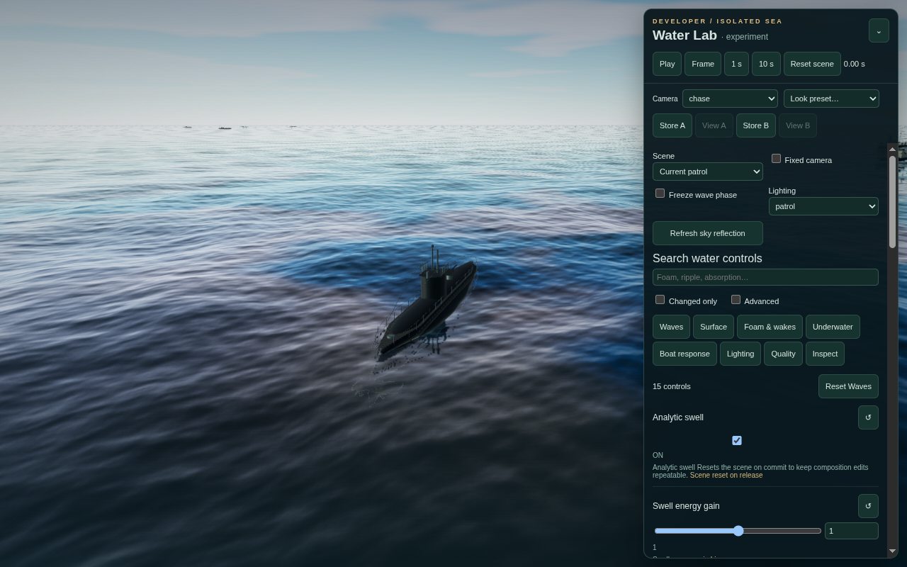

# Water Lab validation

Closure review against the original six phases and acceptance matrix in [the implementation plan](water-implementation-plan.md). Implementation and local acceptance verification are complete. The machine-readable results are in [water-validation.json](water-validation.json).

## Review changes

The closure review retained the existing Three.js/Rapier architecture and all planned phases. It corrected:

- A cancelled recipe replay could still apply its final camera/actions to a reset experiment. Cancellation now invalidates the completion work; pause, reset, exit and loss of focus stop active advances.
- New-career creation during a lab could inherit experimental configuration. It now takes the parked career's configuration.
- Ultra water memory exceeded the old 2 MB career import limit. Career import accepts up to 4 MB, matching bounded water recipes. Large exports use compact JSON; recipe export validates its own output.
- Recipes rejected signed ship seeds supported by existing careers. Explicit crossing-scene ships now retain moving wake sources after reconstruction.
- Recovery now writes both true and false pause states into the reload URL, preserving launch/patrol state without retaining a stale pause flag.
- Replay applies its final weather/lighting and synchronizes the Freeze wave phase checkbox while paused.
- Live scalar edits are recorded on input at the first affected simulation frame, including changes made while playback continues before control release.
- Ordinary Settings now coalesces expensive water edits and career saves instead of serializing the entire water field on every slider event. A browser assertion checks 20 inputs produce one save.
- Evicting bounded wake history also retires its emitter/contact records. Distant foam patches have soft edges and retain overlap along the stored curve as they thin.
- Persistent crest foam now follows the same configured wind/current drift as local foam, with bounded periodic transport and decay.
- Starting orientation also exits the AI lab, completing mutual exclusion among the three experiment modes.
- Manual GPU verification advances Three's frame clock while native animation is stopped. This prevents stale reflection/shadow maps from contaminating screenshots. A controlled comparison confirmed a diagonal band in earlier captures was a harness artifact; no renderer workaround is retained.

No dependency versions or lockfiles changed. The standalone build remains self-contained.

## Acceptance evidence

| Requirement | Authoritative checks |
| --- | --- |
| Schema and functioning controls | Shared typed defaults/validation in `setting-controls.js`, `water-settings.js` and `config.js`; 213 game settings and 143 water controls. Runtime consumer review covers shader uniforms, simulation scalars, six generated swell components and three generated band gains. `water-lab.test.js`, developer browser controls and actual recipe file imports cover validation and atomic failure. |
| Phase, spectra and bounded queries | Unit tests exercise instantaneous speed/chop continuity, seed/wind transitions, frozen phase, shared coefficients across resolutions, analytic mode normals/velocity, Fourier travel direction/compression, extreme determinant/residual bounds. `audit-water-fields.mjs` samples all spectrum resolutions and two seeds at four times. |
| CPU/GPU agreement | Water Lab verifier executes the actual TSL height query and mesh displacement on WebGPU and WebGL 2. Height and displacement are compared to CPU references within 3.5 cm, including mesh filtering and half-float textures. |
| Time and replay | Ordinary 60 Hz updates and exact 30 Hz steps produce equal one-second snapshots. Pure queries do not age water. Browser controls cover exact stepping, held A/B, camera replay, freezing, cancellation and scene resets. Existing navigation/date-line tests cover strategic travel and coordinate continuity. |
| Local interaction and foam | Tests cover all 128/256/512 local resolutions at maximum propagation, diffusion and transport; conservative impulses, stopped-hull wetness, world-coordinate recentering, decay, impacts and depth attenuation. Field audit measures energy decay, boundary tails and resize error. Crest transport has an independent center-of-mass and decay test. |
| Hull response | Flat-water equilibrium at the existing mass of 750, north/east transform signs, head-versus-beam response, settling and full submergence. Existing combat/navigation regressions preserve control and weapon behavior. |
| Lifecycle and isolation | Browser checks compare parked careers, allowlisted apply, repeated open/reset/close, tutorial and AI transitions, career import, new career, disposed experiments, restored pause/HUD/camera, cleared inspection modes and device-loss recovery from launch and patrol. |
| Persistence | Legacy career/playtest checks; water memory round-trip and corrupt optional memory recovery; Ultra export size check plus actual import of a career over 2 MB; signed ship seeds and explicit crossing ships reconstruct. History remains bounded to 64 trails × 160 samples with fixed local/spectral fields. |
| UI | Actual F2 and Settings entry, desktop dock width, 393×852 and 852×393 bottom sheets, no horizontal overflow, collapse, keyboard return, precise controls, A/B and file controls. |
| Rendering and resources | Shader generation and GLES driver linking enforce at most 16 fragment samplers. Both backend browser suites cycle scenes/quality/refraction and compare warm texture, buffer and shader counts. Matched captures and motion review supplement numerical checks. |

The numerical field audit passed six spectrum stress cases (32/64/128 samples, seeds 42/1942, four phase times): minimum sampled Jacobian **0.694861**, maximum inverse residual **0.000500 m**. The largest sampled height at combined maximum artistic gains was **73.95 m**; this deliberately extreme setting is not a measured significant wave height or a realistic storm preset.

| Local grid | Energy remaining after 14 s | Late/early boundary probe ratio |
| --- | ---: | ---: |
| 128 | 3.170% | 0.00837 |
| 256 | 3.446% | 0.01391 |
| 512 | 3.530% | 0.01678 |

The boundary ratios include dispersive pulse tails; they are not isolated physical reflection coefficients. The resize fixture's sampled height and foam errors were zero at 128→256→512→128. These are sampled fixtures, supported by the analytic contraction and fixed-step stability limits, rather than an exhaustive enumeration of every input combination.

## Current-build commands

The following checks passed. Local logs are in `artifacts/water-closure/`; structured browser results remain in each verifier's artifact directory. Browser tests use the packaged HTML except `test:boot:dev`, which checks deferred loading through Vite. GPU browser suites run sequentially.

| Command | Result |
| --- | --- |
| `npm run check` | Pass. |
| `npm test` | 83 tests, zero failures. |
| `npm run build` | Self-contained HTML, 4.69 MB. |
| `npm run test:water-driver` | Eight shader-generation cases, four actual GLES links; water uses 15 fragment samplers with shadows, below the limit of 16. |
| `npm run test:water-browser` | Both actual backends; scene/quality/refraction/save cycles and stable warm resource counts, zero browser errors. |
| `npm run test:water-lab` | Both backends; GPU parity, desktop/touch UI, exact steps, live edit timestamps, A/B, recipe files/camera, cancellation, lifecycle/recovery and resource checks. |
| `npm run test:developer` | Nine groups of checks, including live controls, profiles, touch layouts and coalesced slider saves. |
| `npm run test:browser` | 22 checks, including combat/progression/navigation, underwater optics, persistence, recovery, touch and offline play. The offline gate waits for a real physics tick instead of a fixed wall-clock delay. |
| `npm run test:boot` | 20 checks, including readable failure modes and offline startup. |
| `npm run test:boot:dev` | Vite defers game modules/styles until preflight and starts WebGL successfully. Agent-browser also opened the F2 Water Lab with no console errors or error overlay. |
| `npm run test:orientation` | Actual lesson controls, combat, progression, navigation and restored career pass. |
| `npm run test:ai-lab` | Ten groups of replay/control/lifecycle checks pass. |
| `node scripts/audit-water-fields.mjs` | Six spectrum stress cases, three local resolutions and resize checks pass; measurements above. |

## Visual review

Reviewed **56 matched stills** (14 fixtures × two builds × two backends) and **six 24-frame motion sequences** at 12 fps. The current capture run reports zero browser errors and records standalone build `48962e944c89`, SHA-256 `2ea32b2e253effcc0f33962efe2a68311c5dec580dac62b664f34580aa6572fa`. Reproduce with:

```sh
xvfb-run -a node scripts/capture-water-review.mjs
```

The script uses the installed `ffmpeg` CLI, preserves raw PNGs, fixture/camera/light/backend metadata and SHA-256 identities, and creates `artifacts/water-review/index.html`. It compares 14 scene/quality fixtures on both backends to the preserved pre-upgrade build. Motion sequences contain actual rendered frames; they are not generated illustrations.

| Review group | Observed result |
| --- | --- |
| Calm noon, stopped hull, straight wake | Water and hull reflections remain legible; wake foam is thinner and less uniformly opaque than the baseline. |
| Low-sun swell and overcast storm | Distinct long-wave and wind-wave structure, with readable dark faces. The heavy/overcast looks reduce environment/planar reflection and the heavy look reduces direct glitter; bright grazing-horizon reflections remain. |
| Grazing view and Mobile/Balanced/Ultra | No open ring cracks in the reviewed views. The quality tiers retain their expected differences in geometric detail. |
| Turning and crossing wakes | The stored turning path remains visible as it ages, and crossing wakes retain separate histories. Distant foam remains a bounded patch approximation: thin aged streaks can break up over waves. |
| Surface crossing and underwater up-view | Hull and underside-window treatment remain legible. Both crossing clips switch underwater state exactly once, without repeated toggling. The refractive blend band is visibly stylized and changes rapidly across the surface; this is still height-field optics. |
| Distant impacts | The impact ring uses the event position beyond the local field; separate weapon/depth cases also pass the water browser verifier. |
| Backend consistency | Fresh reflection/shadow updates remove the stale-map capture artifact. Across the 24 matching turn frames, normalized RGB RMSE has mean 0.00550 and maximum 0.00612 between WebGL and WebGPU; pixel identity is not required. |

Representative lossless screenshot copies are checked in below. The full local gallery includes all raw views and clips.

| Scene | Before | After |
| --- | --- | --- |
| Calm noon |  |  |
| Overcast storm |  |  |
| Underwater up-view |  |  |



## Performance

All six cases passed with zero browser errors. The profiler excludes 12 warmup callbacks and samples 24 animation callbacks that rendered, recording p50/p95 intervals, inclusive CPU timings and allocation ranges. These percentiles describe a short software-adapter sample. A lab callback can render multiple exact simulation steps, so it is counted once for frame intervals. Preparation/query/interaction/upload/submission timings overlap and must not be summed. No GPU timestamp measurement is claimed.

| Case | Frame interval p50 · ms | Frame interval p95 · ms | CPU callback p95 · ms | Render submission p95 · ms |
| --- | ---: | ---: | ---: | ---: |
| Patrol, lab closed | 1065.2 | 1092.4 | 33.7 | 12.0 |
| Patrol, planar reflections off | 1049.5 | 1084.0 | 29.2 | 9.1 |
| Lab, heavy head seas | 3759.2 | 3821.8 | 41.8 | 23.0 |
| Lab, crossing boats | 3764.6 | 3804.4 | 48.0 | 28.8 |
| Lab, underwater | 3129.4 | 3248.7 | 21.4 | 9.9 |
| Lab, repeated uniform tuning | 3767.7 | 3872.6 | 39.8 | 21.6 |

| Case | Water preparation p95 · ms | Surface queries p95 · ms | Local interaction p95 · ms | Upload preparation p95 · ms |
| --- | ---: | ---: | ---: | ---: |
| Patrol, lab closed | 9.7 | 6.8 | 5.6 | 5.8 |
| Patrol, planar reflections off | 9.3 | 6.7 | 5.2 | 3.9 |
| Lab, heavy head seas | 11.9 | 3.2 | 6.4 | 12.8 |
| Lab, crossing boats | 12.2 | 6.1 | 7.5 | 13.9 |
| Lab, underwater | 11.1 | 0.7 | 0.0 | 5.3 |
| Lab, repeated uniform tuning | 11.5 | 2.8 | 6.5 | 12.7 |

All six cases held **27 textures, 51 geometries and 152 attributes** throughout the measured window. Builder, pipeline and shader-state counts also remained constant within each case (63 shader states for patrol, 60 for single-boat lab scenes and 97 for crossing boats). These are warm-window observations, supplemented by the separate scene/quality disposal tests.

The long wall intervals reflect this software-rendering setup. They do not establish the 30 FPS mobile or 60 FPS desktop targets. No physical-device FPS or GPU timestamp result is available. The lab can submit multiple exact-step renders per callback, which is reflected in its higher cost.

Reproduce with:

```sh
AUDIT_CASES=original,no-reflections,lab-open,lab-boats,lab-underwater,lab-tuning AUDIT_REPORT=water-closure npm run profile:renderer
```

## Limits

The ocean remains a height field with bounded, game-oriented probe motion; it is not calibrated hydrostatics. Planar reflection uses the mean surface. Fluid velocity and optical path length are approximations. The near mesh filters short wavelengths separately from shader detail. Extreme artistic gains can produce exaggerated heights while effective chop keeps the horizontal mapping invertible.

Verification uses Chrome under Xvfb and SwiftShader on WSL. Software frame intervals establish neither desktop GPU nor phone FPS. Device targets remain targets requiring measurements on the relevant hardware. Local raw captures and logs are ignored build artifacts; this report records the durable conclusions.
